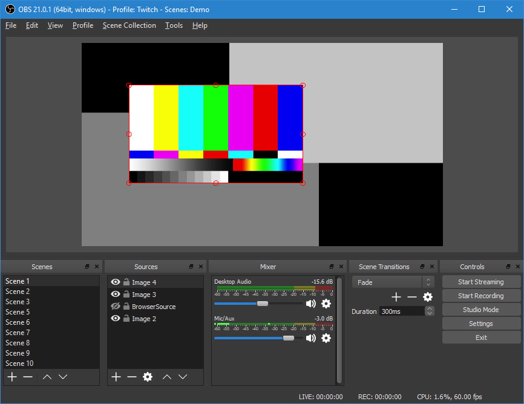

# 直播教育訓練

## Part 1

## COSCUP 2018

---

## 前言

---

## 前面的廢言(X

---

@size[2.5em](直播對大會來說)

---

## 為大會紀錄珍貴的議程
## 促進更多開源軟體的交流
## 以及知識的傳播

---

@size[2.5em](直播對個人來說)

---

### 藉由直播組的教育訓練活動，
### 讓對 COSCUP 直播有興趣的社群朋友
### 能夠清楚知道活動直播該怎麼做及
### 身為直播組組員的我，需要做什麼事......

---

## 更好的是
## 未來在社群/工作/個人的利用

---

## 也許你下個禮拜就有活動
## 馬上問主辦單位缺不缺直播啊(?)

---

@size[2.5em](正文開始)

---

## 那直播的教育訓練
## 到底是要訓練些什呢?

---

## 先來想想如何在 10 秒內打開 Facebook 直播 

---

## 感覺聽起來不難

---

## 大概會有這樣的流程

@ul
- 有一支有攝影鏡頭的手機
- 有速度不慢的網路
- 有 Facebook 帳號
- Facebook 直播按下去
- 完成
@ulend

---
### 若還要厲害點, 你可能還要這些

@ul
- 擷取卡
- 傳輸線
- 電腦/筆電一台
- 另一支手機
- 耳機
- 另一個人幫你監控
- 補光
- 背景/地點
- 直播時間
- .....
@ulend

---

## 為了有更高的品質
### 更周全的準備是必要的

---

## 來看看前輩經驗分享

[透過 Facebook 直播影音的經驗分享](https://medium.com/@ericsk/%E9%80%8F%E9%81%8E-facebook-%E7%9B%B4%E6%92%AD%E5%BD%B1%E9%9F%B3%E7%9A%84%E7%B6%93%E9%A9%97%E5%88%86%E4%BA%AB-b5d180970b6a)

---

### 看完有沒有覺得耳目一新？

---

## 什麼！沒有？ 
### 那這份簡報就到此為止了....

---

## 下台一鞠躬...感謝大家

---

## 等等....別走

---

## 想像一下 COSCUP 會是怎麼樣？

---

## 我們在 COSCUP 會做這些事

---

## 這屆的目標只有一個
### (就跟真相一樣)

---

# 把議程的內容`穩穩的`記錄下來

---

## 聽起來很籠統?

---
## 其實從直播來看
### 可以簡化成這三點

@ul
- 輸入
- OBS
- 輸出
@ulend

---

## 記住這三點
### 你已經成功一半了呢(?)

---
## 先來看看設備有什麼

- 錄影機
- 錄影機腳架 / 人體腳架(?)
- 外接麥克風
- VGA splitter (1in-2out)
- VGA to 3G-SDI converter
- PC with 3G-SDI capture card
- 網路設備

---

### 首先
@size[2.5em](輸入)

---

## 聽說很認真看簡報
### 你就會看到接下來的清單

---
### 機器相關
      - 租借
        - 租借設備與攝影機組成(攝影機主機、電源(接市電(一般稱為"假電")或電池供電)
        - 簽約費用與保證金、租借期限等細節 
      - 搬運
        - 自行開車或直接叫Uber
      - 位置決定
        - 考慮因素
        - 通常是位於會議廳往後三排的中央位置或教室後方
      - 腳架定位
        - 地面影響
        - 腳架水平: 腳架上附有一個可供參考的水平儀, 珠子必須在圓圈內
        - (示意圖) http://www.dvc.com.tw/ecommerce/gitzo_gleve1.html 
      - 攝影機上架
        - 雲台安裝
        - 角度調整
      - 線材接上
        - 與電腦連接: 3G-SDI <==> PC 3G-SDI capture card
        - 與電源連接: AC市電 <==>  錄影機假電 
      - 開機測試
        - 畫面拍攝準則
        - 確認記憶卡?
        - 確認錄影機設定:
          - 解析度: 1920x1080 60i
          - 快門: 自動
          - 光圈: 手動
          - XLR 開關: Enable (有外接麥克風的那一channel)
        - 攝影機操作與設定
        - 攝影機縮放
---

## 當你搞定上面
### 接下來就換整合面的軟體了

---

### 再來
@size[2.5em](OBS)
##### Open Broadcase Studio

---
## 基本上有這些

@ul

- 基本操作
- 設定檔匯出/匯入
- 加上簡報畫面
- 製作轉場畫面
- 如何切換場景
- 切換場景時機
- 設定快速鍵 (方便實際操作組員操作)
- 設定影片儲存位置
- 更多內容請看官網

@ulend

---
## 但還有很多其他功能
---
## 有勞各位下載試試
---
## 教學影片蠻多的
---

### 最後
@size[2.5em](輸出)

---

## Youtube 放送
## 預先建立直播需要的金鑰
## OBS 設定金鑰

---
## 除了這直播的三點..還有
@ul
- 場佈
- 值班
- 意外通報
@ulend
---

## 這些大概就是我們要做的

---

## 剛看完馬上來點小考

---

## 快問快答

---
## 真相只有一個是出自何處?
---
## 設備會不會自己擺在會場?
---
## OBS 的全名是什麼?
---
## 直播簡單分哪三點?
---
## 今年 COSCUP 是第幾屆?
---

### 什麼! 太簡單了? 

---

## 那還不你快來救救我們
## 教育訓練 Part 2 等著你啊

---

## 最後, 
### 前輩的經驗可是不能忽略的哪

- [一張圖 教你學會專業直播架設](https://blog.livehouse.in/2017/04/how-to-build-pro-livestream.html)
- [當BBC演播室製作監督的秘訣](http://www.bbc.co.uk/academy/zh-hant/articles/art20160504083613160)

---

## 相信這個短短的簡報
## 無法帶太多給你

---

## 雖然可以寫得一定更多
## 但太多感覺很煩

---

## 所以
### 就長話短說

---

## 可能也是沒得說了(?)

---

## 不足的地方歡迎來協作 XD

---

## 呼~ 好像告個段亂了

---

### 如果覺得裡面沒什麼內容的話

---

# 請記得這句

---

@size[2.5em](準備是關鍵)
@size[2.5em](Perparation is the key)

---

## 所以
## 事前的實際操作也不能少啊啊啊

---

## 直播教育訓練 Part2 
## 提供設備讓現場你做直播
# 7/28 13:30 管地

---

# 快來參加

---

## 無法到場參加有直播
## 無法當天參與有錄影

---

## 直播教學直播啊
## 到底是直播還是在教學?

---

@size[2.5em](End)

---

## 其實.....你以為只有這樣...

---

# 那就錯啦!

---

## 之後很多東西可以玩呢

@ul
- 多平台
- 人臉追蹤
- 語音轉文字
- 翻譯
- 設備自動化控制
- 軟體自動化控制
- 與議程互動
- 等你提供想法
@ulend

---

## 不是今年就對了

---

## 歡迎送 pull request

---