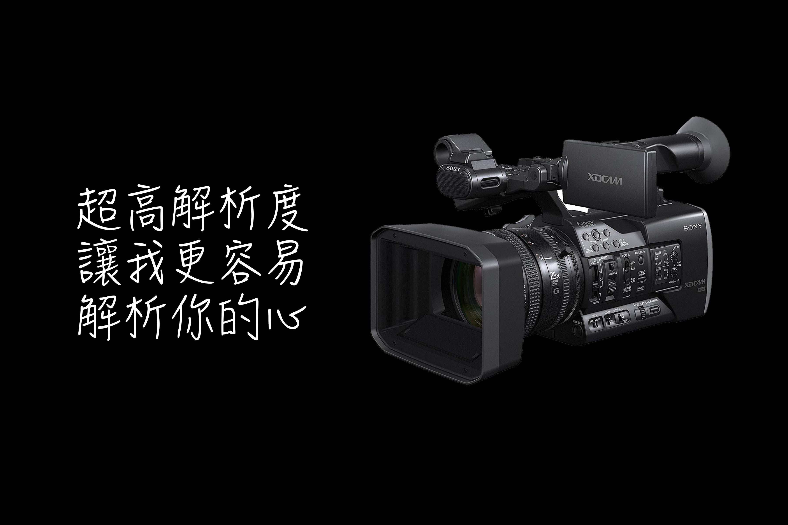

# 直播教育訓練

## Part 2

## COSCUP 2018

---

## 前情提要
[教育訓練 Part 1](http://gitpitch.com/canyugs/live-streaming-training/Part1-preparation-is-the-key)

---

## Part1 已經做了簡單的介紹
## 接下來就直接進入正題囉

---

## 之前有提過三大部分
* 輸入
* OBS
* 輸出

---

## 這次就來更深的看下去

---
## 每間教室要有以下的設備
* 錄影機
* 腳架
* 收音麥克風+麥克風腳架
* VGA分割器
* VGA to SDI 轉接器
* PC (含鍵盤、滑鼠、螢幕及螢幕線)
* SDI(1-2條)、VGA線材(2-3條)
---

## 輸入

---

## 架構圖一張

---

## 攝影機操作 (以Z150為例, 每台的按鍵位置可能不同, 但操作都是類似的)

---

---

---

---

---

---

---

---

## 腳架
Sachtler

---

Libec

---

## 擷取卡設定(這一定要做, 不做OBS抓不到訊號)

* DeckLink 擷取卡必須把Video input 下面的SDI Enable (預設是停用)

---
## 線材連接

---

* 錄影機上面會接兩條線 (假電池[直接接AC] 圖內細線, SDI out [圖內圓的粗線])

---

* VGA 1轉2

---

* PC 後端接法 (DVI-I 輸入 + SDI 輸入) 或 (SDI 兩軌輸入)

---

## OBS

---

## 執行 OBS

---

## 匯入場景群組, 固定場景, 來源

---

## 匯入設定檔, 場景解析度, 一般設定, 直播設定

---

## 左邊為準備畫面
## 右邊實際錄製畫面

---

## 按下中間轉場後

---

## 左邊為準備畫面
## 右邊實際錄製畫面

---

## 來源是從這些類別加入的

---

## 來源的畫面可以調整大小, 不論是選單內的設定
## 或是自己拉大小都可

---
## 設定影像, 設定音效, 確認排版位置

---

## 依據上次的經驗(多太亂), 感覺這次只需要 2 種
* 錄影場景
* 休息場景

---

確認開始時間, 提早開始錄製
## 5分鐘

---

## 開始錄製
## 開始串流(視場地而定)

---

## 接著就是監視他了!
* 畫面聲音是否同步?
* 攝影機是否正常錄製?
* 電腦是不是要自動更新？ (要關閉自動更新)
* 會眾是不是會跑來踢掉你的線? (直接用地貼的方式處理[直接將線黏到地板上])

---

## 還有什麼可以做呢？
@ul
* 時間註記
* 即時字幕
* 遠端控制 OBS
* ...各種外掛
* 以後有空再說 Orz
@ulend
---

## 輸出

---

## 其實就
* 開好直播活動
* 取得金鑰
* 設定OBS
* 監聽是否有異狀, 再來現場調整

---

## 在 COSCUP 中會是怎麼樣？

---

## 這次活動總共會有三天
@ul
* Day0(08/10) 下午場佈 器材架設, 確認是否運作
* Day1(08/11) 第一天 執行任務
* Day2(08/12) 第二天 執行任務, 器材回收
@ulend

---

## Day 0 器材架設

* 腳架定位
* 攝影機定位
* 主機螢幕定位
* 收音設備定位
* 線材連接, 電源, 錄影影像, 講師電腦影像, 收音, 網路(直播用)

--

## 啟動系統
* 攝影機開機
* 電腦開機
* OBS 啟動
* 匯入 OSB 設定檔

---

## 實際測試
1. 攝影機畫面是否正常
2. 攝影機Zoomin/Zoomout 操作
3. OBS 畫面輸入是否正常
4. OBS 聲音是否正常
5. 線材是否牢固, 線材是否位於聽眾動線, 避免絆倒

---

## 測試完畢
## 待第二人確認

---

## 貴重器材回收, 其餘留置原地
* 攝影機
* 收音設備
* 影像擷取卡
* 主機

---

## 活動開始前

* 攝影機上腳架
* 主機接上
* 擷取卡接上
* 收音設備接上
* OBS 執行
* 確認設定檔無誤
* 攝影機位置調整

---

## 第一天活動結束
* 器材關機, 貴重設備回收

---

## 活動期間

* 執行任務, 監聽直播/錄影
* 依照排班輪調
* 緊急狀況通知

---

## 活動結束後

* 設備回收, 回收於 XX 地點

---

## 其他注意事項?
* 這份簡報是大方向, 若有異動以現場為主

---